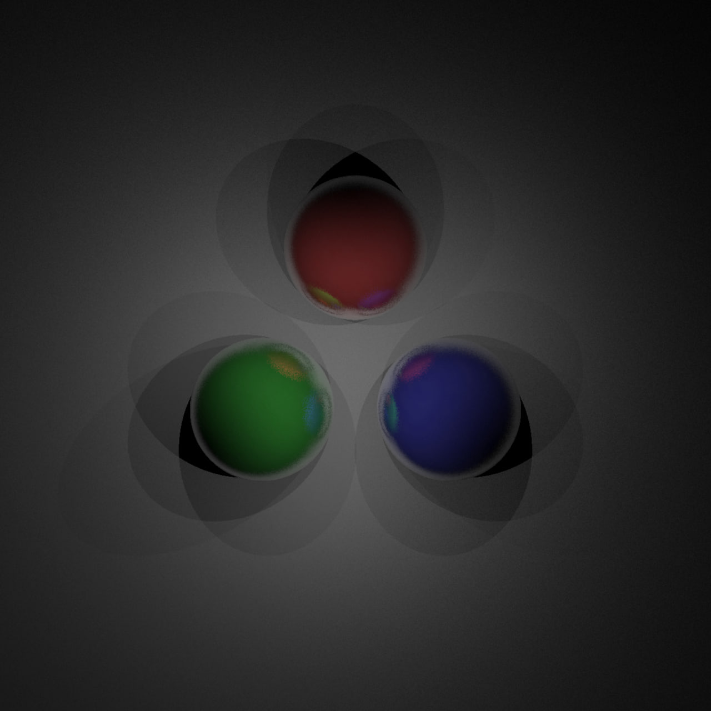

# raytracer
This program is creates images according to scene configuration file.

## what can the program do
In scene you able to set camera location, camera direction, lights location,
object properties and shapes. And program will generate image of this scene
using simple ray tracer algorithm.



## aim of this project
I wanted just try Rust program language, and create small pet project with it.

## features
 + reflection
 + diffusion

## usage

```bash
./raytracer <path/to/configuration/file.toml>
```

## scene

```toml
[image]
# file name of the result image generated by raytracer program according
# to configuration file 
name = "reflect"
# width of the image in pixel (required)
width = 1280
# height of the image in pixel (required)
height = 1280

# Euclidean space.
#     y |
#       |_____x
#       /
#     z/
#
# There are a lot of things to set in this configuration file by Vectors in Euclidean space,
# for example direction and locations.
# Vector or Point looks like this:
# example = [1.2, -0.3, 2.0]
# That mean Coordinates of this Vector is (X, Y, Z) = (1.2, -0.3, 2.0)

# location and direction of the view on objects in scene (required)
[camera]
origin = [0.0, 0.0, 20.0]
view = [0.0, 0.0, -1.0]
# up is where camera has up, so camera can be rotated around view by this Vector (up)
up = [0.0, 1.0, 0.0]

# Location of the spot light
# (you can have multiple spot lights in your scene)
[[scene.lights]]
origin = [0.0, 0.0, 5.0]

# Sphere object in scene
[[scene.spheres]]
# location of the object
center = [0.0, 3, 0.0]
radius = 2.0
# Properties of surface of this object
  [scene.spheres.properties]
  # RGB color of the object
  color = [255, 100, 100]
  # Reflection coefficient of the object's surface
  reflection = 0.5
  # diffusion coefficient (not physical)
  diffuse = 0.2
[[scene.lights]]
origin = [0.0, -3, 5.0]

[[scene.spheres]]
center = [-2.598, -1.5, 0.0]
radius = 2.0
  [scene.spheres.properties]
  color = [100, 255, 100]
  reflection = 0.5
  diffuse = 0.2
[[scene.lights]]
origin = [2.598, 1.5, 5.0]

[[scene.spheres]]
center = [2.598, -1.5, 0.0]
radius = 2.0
  [scene.spheres.properties]
  color = [100, 100, 255]
  reflection = 0.5
  diffuse = 0.2
[[scene.lights]]
origin = [-2.598, 1.5, 5.0]

[[scene.spheres]]
center = [0.0, 0.0, -100001.0]
radius = 100000.0
  [scene.spheres.properties]
  color = [200, 200, 200]
  diffuse = 0.4
```
